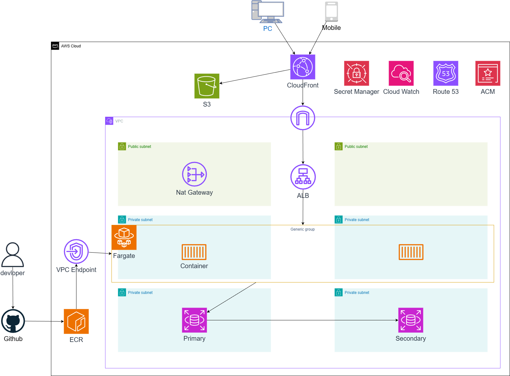

# ECS - Terraform

AWS 上で ECSを冗長化する構成を Terraform でコード化したものです。

実際の現場ではmodule化して環境ごとに使い分けているようですが、個人開発レベルなので単一のディレクトリにしています。

# 構成図



## アーキテクチャ概要

```
Internet
    ↓
Route53 (haru-aws.link)
    ↓
CloudFront (HTTPS / CDN)
    ├── /static/* ───────────────────────────────── S3 (Static Assets)
    └── /* ──→ ALB
                │
                │  VPC (10.0.0.0/21)
                ├─────────────────────────────────────────────┐
                │  Public Subnet (10.0.1.0/24 / 10.0.2.0/24) │
                │  ALB・NAT Gateway                           │
                ├─────────────────────────────────────────────┤
                │  Protected Subnet (10.0.3.0/24 / 10.0.4.0) │
                │  ECS Task 1a  │  ECS Task 1c  (Fargate Spot)│
                ├─────────────────────────────────────────────┤
                │  Private Subnet (10.0.5.0/24 / 10.0.6.0)   │
                │  RDS Mysql (db.t3.micro)               │
                └─────────────────────────────────────────────┘

GitHub Actions → ECR → ECS Deploy
Secrets Manager → RDS Credentials
```

## ファイル構成

```
ecs-terraform/
├── main.tf             # Terraform provider・locals
├── variables.tf        # 変数定義
├── terraform.tfvars    # 変数値
├── outputs.tf          # 出力値
├── network.tf          # VPC・Subnet・Route Table
├── security_groups.tf  # Security Group (ALB / ECS / RDS)
├── alb.tf              # Application Load Balancer
├── ecs.tf              # ECS Cluster・Service・Task Definition
├── iam.tf              # IAM Role・Policy
├── auto_scaling.tf     # Auto Scaling
├── rds.tf              # RDS・DB Subnet Group・Secrets Manager
├── acm.tf              # ACM Certificate (us-east-1)
├── route53.tf          # Route53 DNS Records
├── cloudfront.tf       # CloudFront Distribution
├── s3.tf               # S3 Bucket (Static Assets)
├── ecr.tf              # ECR リポジトリ・ライフサイクルポリシー
├── backend.tf          # Terraform リモートステート (S3)
└── vpc_endpoints.tf    # VPC エンドポイント (ECR / S3 / CloudWatch Logs)
└── README.md
```

## コスト計算

- Route 53:0.50ドル
- ALB: 28.30ドル ※PublicIPx1無料
- Fargate:11.09ドル ※Spotで7割引可
- NAT: 48.24ドル ※右側の構成のみ
- RDS: 18.72ドル
- Secrets Manager ~0.40ドル 1シークレット/月

## 特徴

- マルチAZ冗長構成（ap-northeast-1a / 1c）
- サブネットを3層（Public / Protected / Private）に分離
- ALBでトラフィック分散
- Fargate Spotでコスト削減
- Auto Scaling（CPU使用率70%でスケールアウト）
- CloudFront + S3でパスごとにALBとS3に振り分ける
- RDSパスワードをSecrets Managerで自動管理
- VPCエンドポイント — ECSからECR・S3・CloudWatch LogsへNAT非経由でアクセス（コスト削減・セキュリティ向上）
- Terraformリモートステート — S3バックエンドでtfstateを管理（チーム開発・CI/CD対応）
